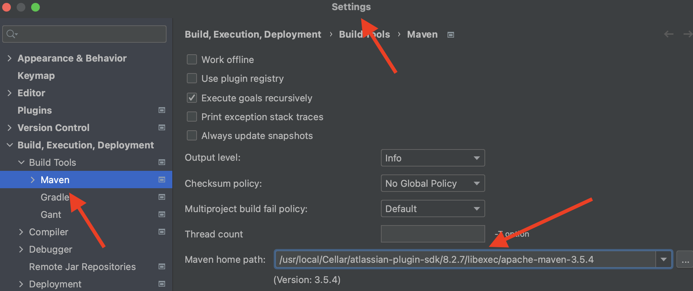

# Dynamic REST
Dynamic REST. Rest accept a JQL string, and return set of fields. REST perform a JQL search and return JSON with the selected fields. The result (issues) output without limitation on the number of displays.

#### Before you begin. 
Install the [Atlassian Plugin SDK](https://developer.atlassian.com/server/framework/atlassian-sdk/), you'll also need the following:  
Java SE Development Kit (JDK) 8 or AdoptOpenJDK 8  
Your JAVA_HOME variable set  

#### Before first run  
JIRA plugin use maven installing inside pligin package so you need to change path to your Maven directory in your IDE  

Path to Maven in MacOS 

usr/local/Cellar/atlassian-plugin-sdk/8.2.7/libexec/apache-maven-3.5.4  

Create template Jira plugin from SDK:

#### `atlas-create-jira-plugin`

You also need to install several plugin modules:
1. Web section / 30
2. Web item / 25
3. Servlet / 21
4. REST plugin module / 14

#### `atlas-create-jira-plugin-module`

Full documentation is always available at:

https://developer.atlassian.com/display/DOCS/Introduction+to+the+Atlassian+Plugin+SDK

